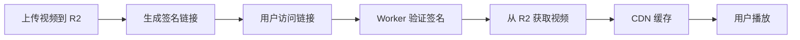

# Cloudflare R2 视频服务器

> 基于 Cloudflare Workers + R2 的视频流服务，支持防盗链、Range 请求、CDN 缓存。

<div align="center">

[](https://deploy.workers.cloudflare.com/?url=https://github.com/your-username/r2-video-server)
[](https://vercel.com/new/clone?repository-url=https://github.com/your-username/r2-video-server)

**[📖 快速开始](QUICK-START.md)** · **[📋 检查清单](CHECKLIST.md)** · **[🔌 API 文档](API.md)**

</div>

---

## 🚀 5 分钟快速部署

### 新手推荐：网页部署

```bash
# 在浏览器中打开
deploy.html
```

1. 填写 R2 存储桶名称
2. 点击"自动生成密钥"
3. 提交，复制命令
4. 在终端运行
5. 完成！

### 命令行部署

```bash
cd worker
npm install
npx wrangler login
# 修改 wrangler.toml 配置
npx wrangler deploy
```

**📚 详细步骤：** [QUICK-START.md](QUICK-START.md)

---

## ✨ 核心特性

| 特性 | 说明 |
|------|------|
| 🎬 **Range 请求** | 支持进度条拖动，秒开任意位置 |
| 🔐 **防盗链保护** | URL 签名 + 过期时间验证 |
| ⚡ **CDN 加速** | Cloudflare 全球 300+ 节点缓存 |
| 📤 **批量上传** | 断点续传，并发控制 |
| 🎨 **前端播放器** | 开箱即用的视频列表和播放器 |
| 🔗 **链接生成器** | 命令行 + 网页版签名工具 |

---

## 📦 项目结构

```
r2-video-server/
├── deploy.html              # 🌟 交互式部署页面（推荐新手）
├── worker/                  # Worker 服务
│   ├── src/index.js        # 核心代码（防盗链+Range+缓存）
│   └── wrangler.toml       # ⚠️ 需要配置
├── frontend/                # 前端播放器
│   ├── index.html          # ⚠️ 需要配置
│   ├── player.html         # ⚠️ 需要配置
│   └── style.css
├── upload-tool/             # 批量上传工具
│   ├── upload.js
│   └── config.json         # ⚠️ 需要创建
├── link-generator/          # 签名链接生成器
│   ├── cli.js              # 命令行版本
│   └── web/index.html      # 网页版本
└── docs/
    ├── QUICK-START.md      # 📖 快速开始（必读）
    ├── CHECKLIST.md        # ✅ 部署检查清单
    ├── API.md              # 🔌 API 文档
    └── GUIDE.md            # 📚 详细使用指南
```

---

## ⚙️ 快速配置

### 必须修改的 3 个地方

#### 1. Worker 配置 (`worker/wrangler.toml`)

```toml
[[r2_buckets]]
bucket_name = "your-bucket-name"  # ⚠️ 改为你的存储桶

[vars]
SECRET_KEY = "your-secret-key"    # ⚠️ 改为强密钥（32位+）
```

#### 2. 前端配置 (`frontend/index.html` 和 `player.html`)

```javascript
const WORKER_URL = 'https://your-worker.workers.dev';  // ⚠️ Worker URL
const SECRET_KEY = 'your-secret-key';  // ⚠️ 与上面相同
```

#### 3. 上传工具 (`upload-tool/config.json` - 新建文件)

```json
{
  "ACCOUNT_ID": "your-account-id",
  "BUCKET_NAME": "your-bucket-name",
  "R2_ACCESS_KEY_ID": "your-access-key",
  "R2_SECRET_ACCESS_KEY": "your-secret-key"
}
```

**📚 详细配置：** [QUICK-START.md](QUICK-START.md#必须修改的配置)

---

## 📖 使用示例

### 上传视频

```bash
cd upload-tool
npm install
node upload.js /path/to/videos
```

### 生成签名链接

**命令行：**
```bash
cd link-generator
node cli.js video/sample.mp4 86400  # 24小时有效期
```

**网页版：** 打开 `link-generator/web/index.html`

### 播放视频

**前端播放器：** 打开 `frontend/index.html`

**直接访问：**
```
https://your-worker.workers.dev/video/sample.mp4?expires=xxx&signature=xxx
```

---

## 🔧 高级配置

### 自定义缓存策略

编辑 `worker/src/index.js`：
```javascript
const cacheTime = 86400;  // 24小时
response.headers.set('Cache-Control', `public, max-age=${cacheTime}`);
```

### 域名白名单

编辑 `worker/wrangler.toml`：
```toml
[vars]
ALLOWED_DOMAINS = "yourdomain.com,www.yourdomain.com"
```

### 自定义域名

```toml
routes = [
  { pattern = "videos.yourdomain.com/*", zone_name = "yourdomain.com" }
]
```

**更多配置：** [QUICK-START.md](QUICK-START.md#常见配置)

---

## 🐛 常见问题

| 问题 | 快速解决 |
|------|---------|
| **403 错误** | 检查密钥是否一致，链接是否过期 |
| **Bucket not found** | 确认存储桶已创建，名称正确 |
| **上传失败** | 检查 R2 API Token 权限 |
| **前端无法加载** | 检查 WORKER_URL 和 SECRET_KEY 配置 |

**详细排错：** [QUICK-START.md](QUICK-START.md#常见问题)

---

## 📚 文档导航

| 文档 | 说明 | 适合 |
|------|------|------|
| **[QUICK-START.md](QUICK-START.md)** | 快速开始指南 | 🌟 所有人必读 |
| **[CHECKLIST.md](CHECKLIST.md)** | 部署检查清单 | 部署时使用 |
| [API.md](API.md) | API 接口文档 | 开发集成 |
| [GUIDE.md](GUIDE.md) | 详细使用指南 | 深入了解 |

---

## 🚀 部署方式对比

| 方式 | 难度 | 时间 | 适合场景 |
|------|------|------|---------|
| 网页部署 (`deploy.html`) | ⭐ | 5分钟 | 新手、初次部署 |
| 命令行部署 | ⭐⭐ | 3分钟 | 熟悉命令行 |
| GitHub Actions | ⭐⭐ | 10分钟 | 团队、自动化 |
| Vercel 前端 | ⭐ | 5分钟 | 需要自定义域名 |

---

## 🎬 工作流程



---

## 🔐 安全建议

1. **使用强密钥**：至少 32 位随机字符串
2. **定期轮换密钥**：建议每 90 天更换
3. **配置域名白名单**：限制访问来源
4. **使用 HTTPS**：Cloudflare 自动提供
5. **监控日志**：`npx wrangler tail`

---

## 📊 性能数据

- **首次加载**：< 3 秒（全球平均）
- **CDN 命中率**：> 95%
- **并发支持**：无限制（Cloudflare Workers）
- **带宽成本**：$0（Cloudflare R2 免费出站）

---

## 🤝 贡献

欢迎提交 Issue 和 Pull Request！

---

## 📄 许可证

MIT License - 随意使用和修改

---

## 🙏 致谢

- [Cloudflare Workers](https://workers.cloudflare.com/)
- [Cloudflare R2](https://www.cloudflare.com/products/r2/)

---

<div align="center">

**[⭐ 开始部署](QUICK-START.md)** · **[📖 查看文档](docs/)** · **[🐛 报告问题](issues/)**

Made with ❤️ for the community

</div>

